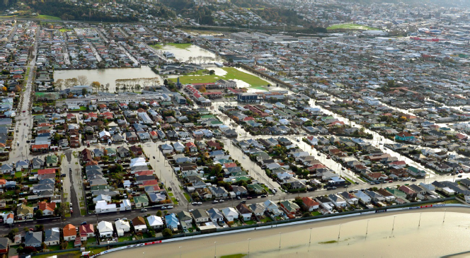

```{r setup, include=FALSE}
knitr::opts_chunk$set(echo = TRUE)
```

## Intro

On the 4th of June 2015 South Dunedin experienced a flooding event. At the time, news outlets reported that 400 emergency call were made regarding the flooding, and that the army, firefighters, and volunteers had sandbagged around 100 houses. Later measurements of surface ponding depth indicated a significant amount of ponding of up to 30 centimetres in depth over the approximately 2.5 square kilometres that were worst affected. A smaller number of measurements were significantly higher with some measurements in the range of 50 to 60 centimetres of ponding above ground level. The effects of the weather event that that precipitated the flooding event were not limited to South Dunedin. The heavy rain caused slips that necessitated the closure of roads. Several schools were evacuated and there was a significant threat to property in the surrounding semi-rural areas built on the floodplain of the Taieri river. However, it is specifically the flooding in South Dunedin, rather than the more widespread effects of the severe weather event, that is of primary interest in this paper. The analysis presented in this paper examines the Dunedin real-estate market and produces estimates of the impact of the 2015 flooding event on residential property prices. The intention is to provide an understanding of the market response to natural hazard risk and changing information in the face of a destructive event.

```{r, out.width='50%', fig.align='center', fig.cap='...', echo = FALSE}

```

Dunedin is of special interest with respect to flood risks. It is a city located at the southern end of the South Island of New Zealand. It is the principal city of the Otago region and the second most populous city in the South Island. As of June 2018 the urban area was estimated to be home to around 122,000 people.

Dunedin has around 2700 residences located within 50 centimetres of the spring high-tide mark. This is higher than any other city in New Zealand and represents a not insignificant proportion of the residential housing stock. These houses face the most immediate risk of inundation due to sea-level rise. The threat of inundation is not one that can be considered in isolation. Rising average global temperatures will not only increase the ground-water level via sea-level rise but will increase the frequency and severity of weather events. The combination of these effects will compound the risks to low-lying properties. The most-recent experience of flooding events are a sobering reminder of this. Most of the properties identified as being at the greatest risk are located on the South Dunedin plain.

```{r, out.width='50%', fig.align='center', echo = FALSE}
knitr::include_graphics(c('../images/south_dunedin_aerial_1.jpg','../images/south_dunedin_aerial_2.jpg', '../images/south_dunedin_aerial_3.jpg'))
```

Geologically, the South Dunedin plain was formed in the last glacial period when the sea-level was significantly lower than it is now. Beneath the plain is a valley of volcanic bedrock. During this glacial period the catchment area that is now the Otago harbour drained through this valley out toward the coast depositing sands, silts, and gravels along the valley bed. As the sea rose to its current level, these sands, silts, and gravels consolidated in the valley to form a relatively flat plain. Prior to European settlement, the area of land on this plain that was suitable to be built upon was considerably smaller. The spring-high tide mark on both the harbour side and to the south extended significantly further inland than the present day coastline. There were large areas of wetland in what are now the suburbs of Musselburgh and St Kilda that drained into a saltwater lagoon inland of the modern high tide mark.

```{r, out.width='50%', fig.align='center', echo = FALSE}
knitr::include_graphics(c('../images/sd_historical_1.jpg','../images/sd_historical_2.jpg','../images/sd_historical_3.jpg'))
```

The mid to late 19th century saw a period of rapid settlement by Europeans. The demand for dry land saw the settlers undertake land reclamation activities. This largely consisted of filling in wet, marshy, or low areas with any available infill material. This included sand that was mined from the nearby coastal dunes. Although early reclamation efforts centred around the shoreline of the harbour, these eventually extended further south to what are modern day residential areas. Early reclamation efforts reflect the level of the groundwater at the time which was up to 17cm lower than the present day level. Subsequent infilling in the 1960’s and 70’s of the harbour-side waterfront with dredge spoil raised the ground level in the area between Portsmouth Drive and Andersons Bay Road to a sufficient degree that the present-day groundwater level is not problematic. However, the ground level of the majority of the South Dunedin plain, comprised mostly of residential properties, remains unchanged since the reclamation activities of the mid to late 1800’s.

```{r, out.width='50%', fig.align='center', echo = FALSE}
knitr::include_graphics(c('../images/sd_historical_4.jpg','../images/sd_historical_5.jpg','../images/sd_historical_6.jpg'))
```

Today, South Dunedin plain has a mix of residential commercial and industrial zoning although the bulk of the plain, and indeed the areas worst affected were primarily residential. For administrative purposes the plain is split into several area units. Area units (or ‘census area units’) are a standard, intermediate administrative unit used by local and state government institutions that represent what might commonly be referred to as a ‘suburb’. Each area unit is comprised of even smaller administrative units known as meshblocks. Meshblocks are the smallest administrative unit of aggregation and are typically comprised of a couple of dozen houses. Commonly the boundaries will run along roads. These might be thought of as small ‘neigbourhoods’ but this is perhaps a less than ideal analogue.

During the June 2015 flooding event only part of the South Dunedin plain was seriously affected. Other areas experienced little to no inundation. This is despite the fact that almost the entirety of the plain has an elevation fairly uniformly within 1 metre of the mean sea-level. Here the mean-sea level might be considered a reasonable if imperfect proxy for the groundwater level. And, at least anecdotally, the uniform ‘low-lyingness’ of the plain as a whole is a proxy for the level of flood risk as might be perceived by real-estate market participants. That is, we might reasonably expect that prospective purchasers of residential properties on the South Dunedin plain to consider the flood risk to all properties with the same elevation above the mean sea-level to be approximately equal either over the long term or in the absence of any additional information (such as the kind provided by a flooding event).

```{r out.width='50%', fig.align='center', echo=FALSE}
knitr::include_graphics(c('../images/sd_elevation_1.jpg'))
```

This expectation, coupled with the non-uniform distribution of inundation resulting from the June 2015 flood forms the basis for understanding the results in this analysis as being those of a so called ‘natural experiment’. Specifically, this analysis presents the results of three questions asked of the natural experiment. Those questions are as follows: 

> _(1)_ How did the real-estate market in Dunedin price flood risks prior to the June 2015 flood?

> _(2)_ Did the price of those risks change in response to the flood?

> _(3)_ Did the spatial distribution of flood-risk prices change in response to the flood?

Further, this paper makes one contribution. That is, to show the magnitude to which the estimation of these results is model dependent. At each stage of the analysis, this paper will compare the results of standard regression methods with those of ‘matching estimators’. Matching estimators are an increasingly common technique used for causal inference in observational studies of treatment effects. Simply put, they are a way of matching treated and non-treated units of observation based on their observed characteristics in order to improve estimates of the causal effect of the treatment. The intention is to replicate as closely as possible the conditions of a randomised controlled experiment given the limitations of observational data. The benefit being that the regression is required to do less ‘work’ when estimating the effect of the treatment. The coefficients estimated in the regression are therefore less sensitive to model misspecification.

To say that a greater degree of model dependence in the unmatched sample, in fact, over or under estimates the true effect of perceived flood risk would require an understanding of the underlying data generating process. This paper attempts to validate matching as a method of improving the performance of the model with respect to the specific data generating process. We use effect plus partial residual plots to visually identify the source of differences in coefficient estimates produced by the matched and unmatched samples.

All of the above questions are addressed in the substantive portion of this paper with each building on the results of the last. That is, the question as to the whether there is a change in the spatial distribution of the ‘flood discount’ is premised on there being a change in the ‘flood discount’ as a result of the 2015 flood event. In turn, the ability to perceive a change in the flood discount requires a baseline measurement of the existing price of flood risk on the South Dunedin plain prior to the flood. Because it is the changes in relative flood-risk price (with respect to location) that are of interest, a natural modelling choice is the difference-in-differences (DiD) approach. The analysis of the final question posed above is presented as the results of an (incomplete) difference-in-difference-in-differences regression. The specific details of the modelling will be explained in further detail in the substantive portion of the paper.

The results might be summarised as follows: Prior to the June 2015 floods the market does not appear to price flood-risks in a way that is statistically detectable. There is no statistically significant ceteris paribus discount associated with properties located on the South Dunedin plain when compared with observationally similar, ‘untreated’ properties. In contrast, the standard regression (on the unmatched sample) estimates a statistically significant mean discount of around 2.5 percent. The mean 2014 sale price of a property on the South Dunedin plain is around \$240,000. Thus, the levels difference in the estimated coefficients might be thought of as being in the region of $6000. That is, the unmatched sample regression estimates a \$6000 discount on the mean property that is entirely absent (or at least not statistically significant) in the matched sample regression. 

There is evidence to suggest that the June 2015 flood provided an impetus for the market to re-evaluate the pricing of flood-risks. The discount associated with being located on the floodplain in the period after the flood is estimated to be around 4 percent. This estimate is statistically significant. The unmatched sample regression also estimated a statistically significant effect of a similar size.

There is evidence to suggest that the flood discount is applied to the area of the South Dunedin plain that experienced some degree of inundation during the June 2015 flood.

Matching goes some way to controlling for changes in the characteristics of properties sold. i.e. the flood may have changed the composition of sales with respect to the observables. Matching the before flood sales FP sales to before flood NFP sales and after flood FP sales to after flood NFP sales there should be an implicit control for changes in the mix of observable characteristics. 

